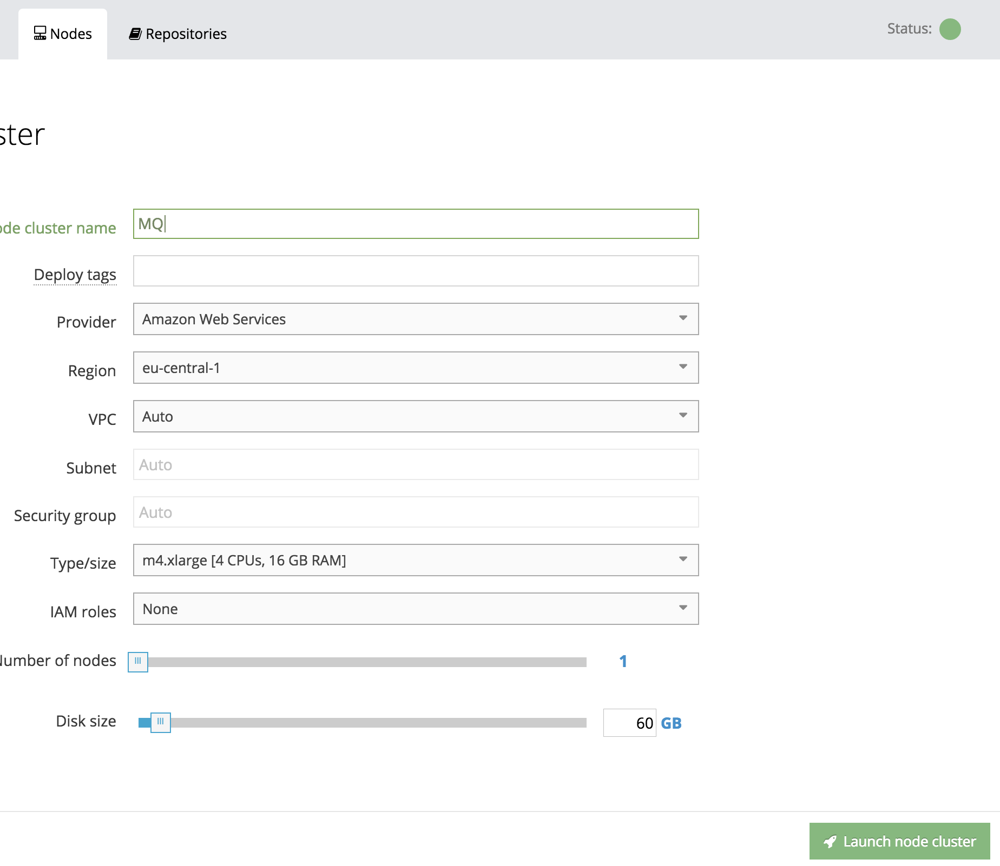
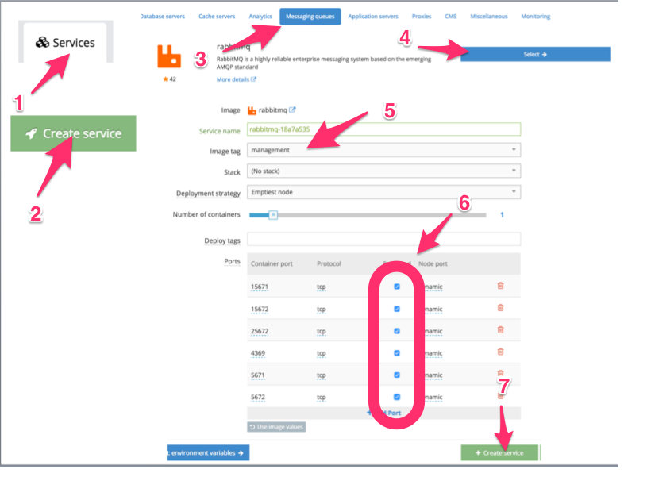
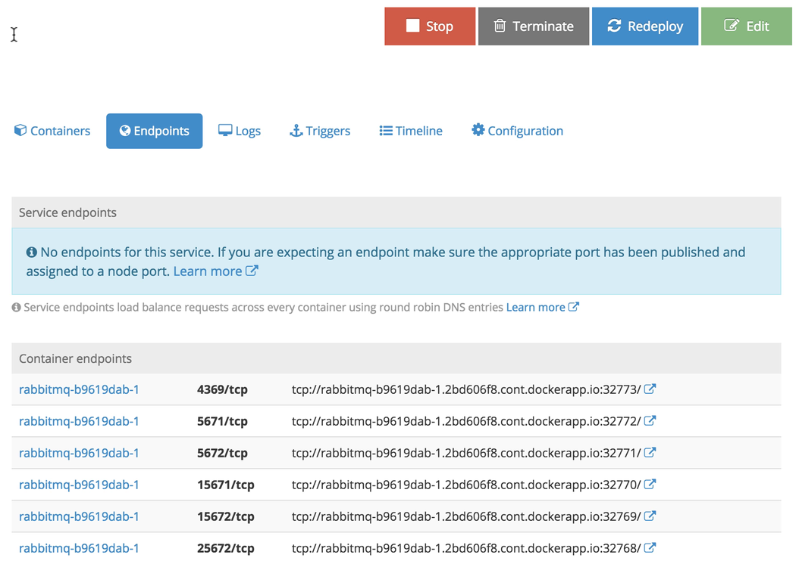
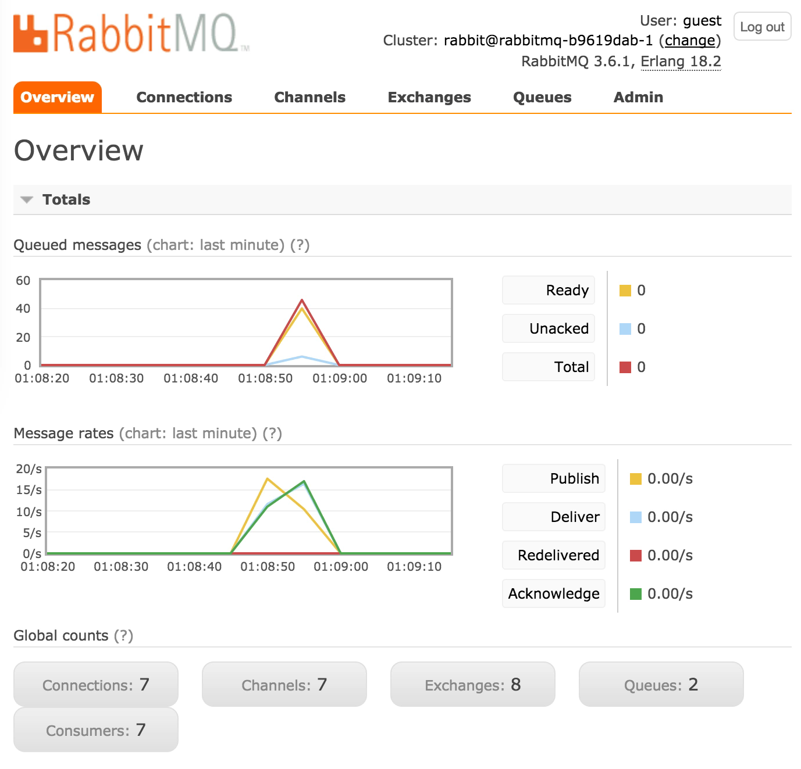
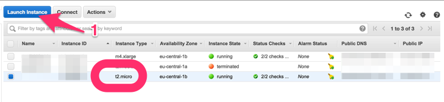
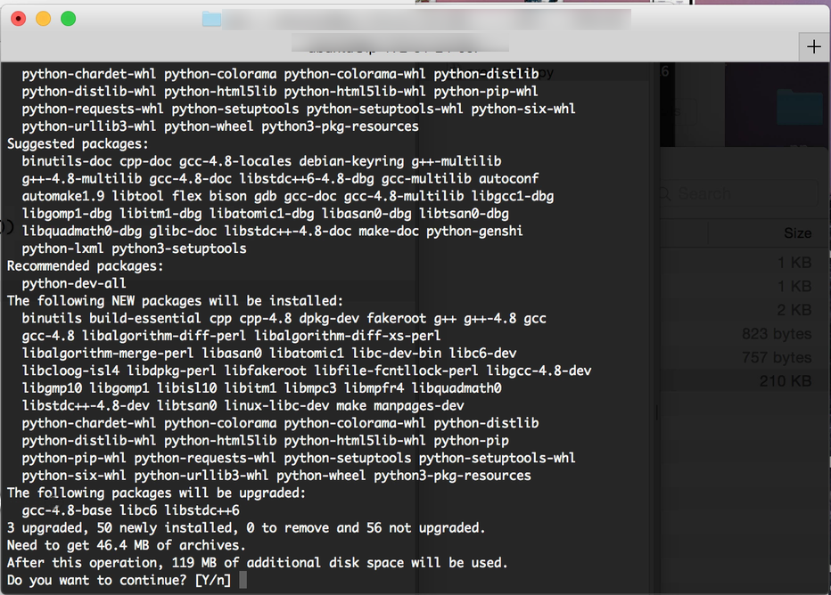
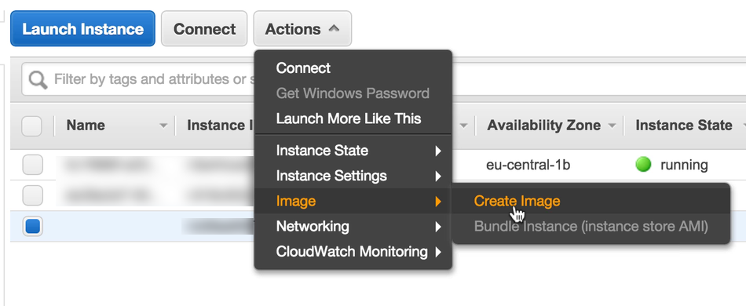
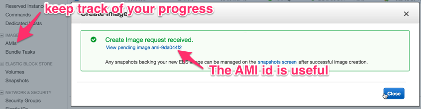
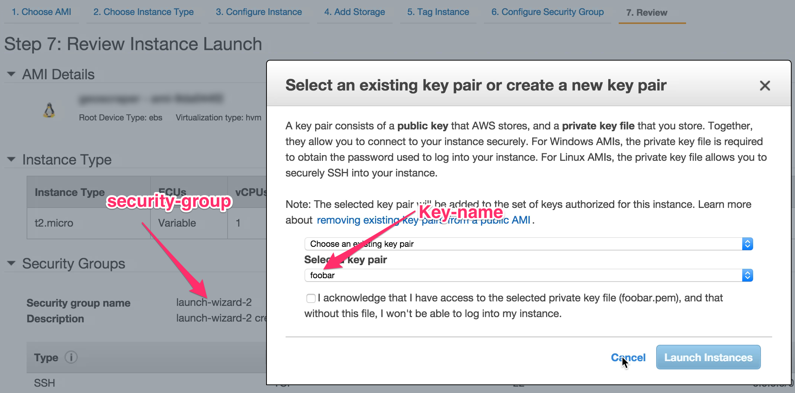

# A zipcode to geo pipeline using RabbitMQ

## Summary

We create a pipeline able to process with high availability many concurrent geoconding requests using a couple of EC2 instances and Python. The entire process is coordinated by two RabbitMQ queues. We use the [Pika](https://pika.readthedocs.org/) Python library to communicate with RabbitMQ and [Docker Cloud](https://cloud.docker.com/) to help us deploy a RabbitMQ container.


## Step 1. Bring up a RabbitMQ service

This is the main point of contact for all the other services, so we start from here. We connect to [Docker Cloud](https://cloud.docker.com/) and give them our EC2 credentials. An `m4.xlarge` instance will do fine. Is it an overkill? Highly likely it is depending on one's use case. Please adjust accordingly.



We then create a service. We have to select RabbitMQ and then the "management" tag which provides the RabbitMQ management console. This helps us keep an eye on the progress of the job. Then we publish all available ports. This is ok for a quick deployment.



After the service starts, we have to go to the endpoints section and make a note of the endpoints for port 5672 which is the main RabbitMQ port (and in our case got renamed by docker to `32771`) and 15672 which is the one for the menagement console (and in our case got renamed by docker to `32769`). Docker does such port renames and it's perfectly fine.



One should be able to visit the menagement console already by visiting the link next to the endpoint and changing the protocol on the URL from `tpc` to `http`.



That's it, the RabbitMQ instance is up and running.

## Step 2. Test the queue by feeding it with some zip codes

Let's assume that we have some zipcodes in a JSON file named `sources.json` in the following format:

```
[
    "EC2V 7HR\tGB",
    "EC2V 7PG\tGB",
    "EC1A 4HD\tGB"
...
]
```

Essentially it's an array of strings that contain a zipcode and the country symbol separated with a tab. This is a nice and easy format. It's easy to modify a bit the basic [Publish/Subscribe RabbitMQ turtorial](http://www.rabbitmq.com/tutorials/tutorial-three-python.html) code in order to post those values to a RabbitMQ queue named `todo_postcode`.

```
with open('sources.json', 'r') as f:
    postcodes = json.loads(f.read())

    # ... initialize the channel ...

    for postcode in postcodes:
        channel.basic_publish(exchange='',
                              routing_key='todo_postcode',
                              body=postcode,
                              properties=pika.BasicProperties(
                                  delivery_mode=2,  # make message persistent
                              ))
```

All the code for this is inside the 27 line [producer.py](producer.py). One just has to adjust the `HOST` and `PORT` variable with the values for the Docker RabbitMQ endpoint we found in the previous step and then it's just a matter of running:

```
./producer.py
```

Within a few seconds one should be able to see the Queued messages in the RabbitMQ console go up.


## Step 3. Create a worker node on EC2

We now have to create an EC2 node to consume those zipcodes, hit the [Google Maps Geocoding API](https://developers.google.com/maps/documentation/geocoding/intro) and put the results (in our case just `/results[0]/geometry/viewport`) back to another queue named `done_postcode`. Please note that Google Maps Geocoding API has limits on its free tier and a paid tier that you can find [here](https://developers.google.com/maps/documentation/geocoding/usage-limits). Some things to keep in mind:

* The Google Maps Geocoding API _may only be used in conjunction with a Google map_; geocoding results without displaying them on a map is prohibited.
* _No caching or storage_. You will not pre-fetch, cache, index, or store any Content to be used outside the Service, except that you may store limited amounts of Content solely for the purpose of improving the performance of your Maps API Implementation due to network latency (and not for the purpose of preventing Google from accurately tracking usage), and only if such storage:
is temporary (and in no event more than 30 calendar days);
is secure; does not manipulate or aggregate any part of the Content or Service; and does not modify attribution in any way.
* _No mass downloading_. You will not use the Service in a manner that gives you or a third party access to mass downloads or bulk feeds of any Content. For example, you are not permitted to offer a batch geocoding service that uses Content contained in the Maps API(s).

My understanding is that if the results are presented in Google maps, you don't store the results anywhere and you respect the limits, you are legal. In any case, I'm not a laywer so please make sure the way you use this code is in accordance with the above and all the other terms.

Back to software. We open our Amazon AWS console and create a new Ubuntu 14.04 `t2.micro` instance. This should be fine since we don't need lots of CPU but just a bit of bandwidth from/to RabbitMQ and to use the Geocoding API.



We use ssh to login to the newly created instance. We update `apt-get` and install python Pika using the following commands:

```
$ sudo apt-get update
$ sudo apt-get install python-pip
$ sudo pip intall pika
```



Now we have to write a little consumer script - once again based on the examples of RabbitMQ. More accurately this will be a combination of a consumer and a producer, since the results are going to be pushed to another RabbitMQ queue. Here's the most interesting part of the code:

```
def callback(ch, method, properties, postcode):
    url = ("https://maps.googleapis.com/maps/api/geocode/json?" +
           urlencode({"address": postcode})) + "&key=" + API_KEY

    resp = requests.get(url).json()

    viewport = resp["results"][0]["geometry"]["viewport"]

    reply = {
        'postcode': postcode,
        'viewport': viewport
    }

    channel.basic_publish(exchange='',
                          routing_key='done_postcode',
                          body=json.dumps(reply),
                          properties=pika.BasicProperties(
                              delivery_mode=2,  # make message persistent
                          ))

    ch.basic_ack(delivery_tag=method.delivery_tag)

    time.sleep(0.2)

channel.basic_consume(callback, queue='todo_postcode')
channel.start_consuming()

```

Some details like error handling and setting up the queues have been ommited but mostly that's it. You can find the complete code in the 69-line [consumer.py](consumer.py).

Note that we do `basic_ack()` after the processing completes and we've inserted the results to the destination queue. This means that if for example the server crashes in the meanwhile, there will be a retry for the unlucky zipcode.

Now, if we set `HOST`, `PORT` and `API_KEY` appropriately and run this script once we will start consuming requests using the API. Note that the delay of 0.2 seconds limits the maximum consumption rate on 5 requests per second, well bellow the limits. What we would now like to do is to auto-start this script every time the machine starts. To do this all we need is to create a `.conf` file in `/etc/init/` by doing for example `sudo nano /etc/init/pygeo.conf` and write the following 3 lines in it: 

```
start on runlevel [2345]
stop on runlevel [!2345]
exec /home/ubuntu/consumer.py
```

After we do this we should do a `sudo reboot` on the machine to confirm that the consumer.py will automatically run. We will be able to confirm that by checking the number of consumers in RabbitMQ console. As soon as the EC2 instance connects, the counter of consumers should go up by one and if we have any post codes pending, they should slowly be consumed. Great, this is a great place to be!

## Step 4. Clone worker nodes on EC2

Now we want to clone this instance and create a few of them to provide high availability. We would like our service to be robust. You can see [here](https://www.rabbitmq.com/ha.html) how to make RabbitMQ highly available. Now we are going to focus on our consumer instance(s). The first step is to go to the AWS console and create an image of our `t2.micro` instance. There is a name that we have to configure but apart from that the configuration is trivial.




Then the confirmation screen appears. It's good for us to note the AMI image ID since we will need it in a bit.



We also click on the AMI tab and keep an eye on the new AMI being created. As soon as it's ready we can clone a few more virtual machines, using the [AWS cli](https://aws.amazon.com/cli/). We have to use the `run_instances` command:

```
$ aws ec2 run-instances --image-id ami-9da044f2 --security-group-ids sg-12345 --count 1 --instance-type t2.micro --key-name foobar
```

Of course instread of `count = 1` we could use larger number to create more instances. As you can see there are several options. The `--image-id` is the AMI ID we talked about earlier. The `--security-group-ids` is an `sg-` prefixed ID that we can find on the "Security Groups" section of our AWS console or by clicking on `t2.micro` instance's properties. the id for the `--key-name` can be found in the "Key Pairs" section of our AWS console. All those were used when we created our `t2.micro` instance but it's easy to forget them or not pay attention to those names/ids:



After running the `aws ec2 run-instances` command we wait a few seconds and the number of instances we created should have registered as consumers in our RabbitMQ console. Now we have a full-capacity, high availability pool of workers on our pipeline. 

## Step 5. Collect your results

We must now collect/consume our results and present them in Google Maps. I will show here how to do it in Python with Pika and leave sending to Google Maps to you since it depends on your implementation ([socket.io](http://socket.io/) `sio.`[emit](https://python-socketio.readthedocs.org/en/latest/#socketio.Server.emit)`(postcode, viewport)` might be an easy way to do it.) Here's the code that appends the result on a temporary file `test.txt`. By appending to that file you can collect many entries and check them while testing. You can find all this code in the 35-line [collector.py](collector.py).


```
def done_postcode(ch, method, properties, body):
    my_resp = json.loads(body)

    postcode = my_resp['postcode']
    viewport = my_resp['viewport']

    entry = {postcode: viewport}

    with open("test.txt", "a") as myfile:
        myfile.write(json.dumps(entry) + "\n")

    ch.basic_ack(delivery_tag=method.delivery_tag)

channel.basic_consume(done_postcode, queue='done_postcode')
channel.start_consuming()

```

Again, it's important to `ch.basic_ack()` after you've completed processing your data. This way, if the server crashes during e.g. `.write()` above, the data won't be consumed/lost but a retry will happen next time you re-run this script.

## Step 6. QC test data

When something goes wrong, [consumer.py](consumer.py) sets `viewport` to `null`. How can we check `test.txt` for such `null`s?

It's easy to read all the contents of `test.txt` in a `found` variable which won't have any duplicate entries:

```
found = {}
with open('test.txt', 'r') as f:
    for line in f:
        ll = json.loads(line.strip())

        postcode = ll.keys()[0]
        viewport = ll[postcode]

        if viewport:
            found[postcode] = viewport
```

Then we can take our original `sources.json` and see if there are any reconds missing:

```
lost = set()
with open('sources.json', 'r') as f:
    postcodes = map(lambda l: ("%s\t%s" % (l[0], l[1])), json.loads(f.read()))

    for i in postcodes:
        if i not in found:
            lost.add(i)
```

We can then take those records and dump them in a file with format similar to `sources.json`:

```
with open("sources2.json", "w") as myfile:
    myfile.write(json.dumps(list(broken)))
```

This code can be found in [qc_test_data.py](qc_test_data.py). We could use [producer.py](producer.py) to retry those missing records.

## Conclusion

This is a quick introduction on how to create a robust pipeline for geocoding-related tasks using AWS, Docker Cloud, RabbitMQ and Python. I hope you will find it useful as a starting point in order to develop your own highly available infrastructure.
